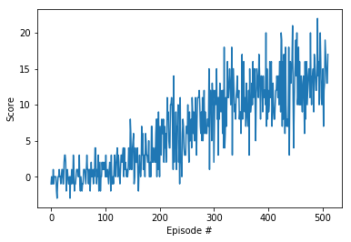
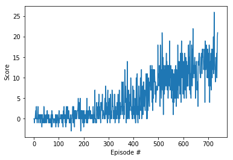

# Learning Algorithm

Two algorithms have been used for comparison:
1) Deep Q-learning (for details go to: https://storage.googleapis.com/deepmind-media/dqn/DQNNaturePaper.pdf)
2) Double-Deep Q-learning (for details go to: https://arxiv.org/abs/1509.06461)
Deep Q-Learning tends to overestimate action values. 
Double Q-Learning has been shown to work well in practice to help with this.

# Network Architecture
```
----------------------------------------------------------------
        Layer (type)               Output Shape         Param #
================================================================
            Linear-1                  [-1, 512]          19,456
            Linear-2                  [-1, 256]         131,328
            Linear-3                  [-1, 128]          32,896
           Dropout-4                  [-1, 128]               0
            Linear-5                    [-1, 4]             516
================================================================
Total params: 184,196
Trainable params: 184,196
Non-trainable params: 0
----------------------------------------------------------------
Input size (MB): 0.00
Forward/backward pass size (MB): 0.01
Params size (MB): 0.70
Estimated Total Size (MB): 0.71
----------------------------------------------------------------

```
# Hyperparameters
```
BUFFER_SIZE = int(1e5)  # replay buffer size
BATCH_SIZE = 64         # minibatch size
GAMMA = 0.99            # discount factor
TAU = 1e-3              # for soft update of target parameters
LR = 5e-4               # learning rate 
UPDATE_EVERY = 4        # how often to update the network
DROPOUT_PROPB = 0.5     # dropout probability
```

# Plot of Rewards
1) Deep Q-learning



2) Double-Deep Q-learning



# Ideas for Future Work
- Prioritized Experience Replay (for details go to: https://arxiv.org/abs/1511.05952)
- Dueling DQN (for details go to: https://arxiv.org/abs/1511.06581)
- Learning from multi-step bootstrap targets (for details go to: https://arxiv.org/abs/1602.01783)
- Distributional DQN (for details go to: https://arxiv.org/abs/1707.06887)
- Noisy DQN (for details go to: https://arxiv.org/abs/1706.10295)

Researchers at Google DeepMind recently tested the performance of an agent that incorporated all six of these modifications including 5 above and DDQN. The corresponding algorithm was termed Rainbow. (for details go to: https://arxiv.org/abs/1710.02298)
